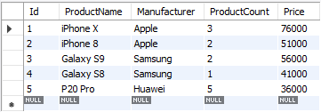
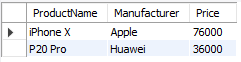
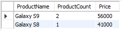

# Урок 1. Установка СУБД, подключение к БД, просмотр и создание таблиц

*__1. Создайте таблицу с мобильными телефонами, используя графический интерфейс. Заполните БД данными__*

*__2. Выведите название, производителя и цену для товаров, количество которых превышает 2__*

*__3. Выведите весь ассортимент товаров марки “Samsung”.__*

**Допы - в презентации (4 и далее, со "\*").**

**Примеры решения:**
