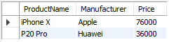
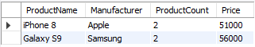
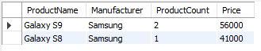
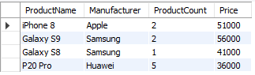
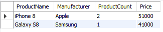

# Урок 1. Установка СУБД, подключение к БД, просмотр и создание таблиц

*__1. Создайте таблицу с мобильными телефонами, используя графический интерфейс. Заполните БД данными__*

*__2. Выведите название, производителя и цену для товаров, количество которых превышает 2__*

*__3. Выведите весь ассортимент товаров марки “Samsung”.__*

---

**Примеры решения:**
__4. **__

__4.1. ***__

__4.2. ***__

__4.3. ***__

__4.4. ***__

